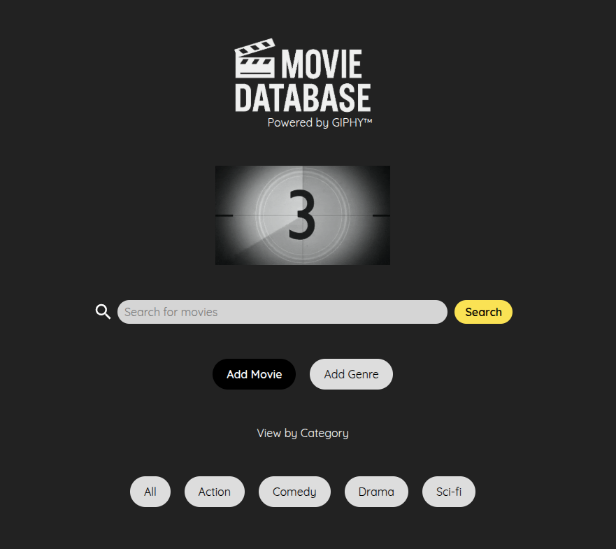
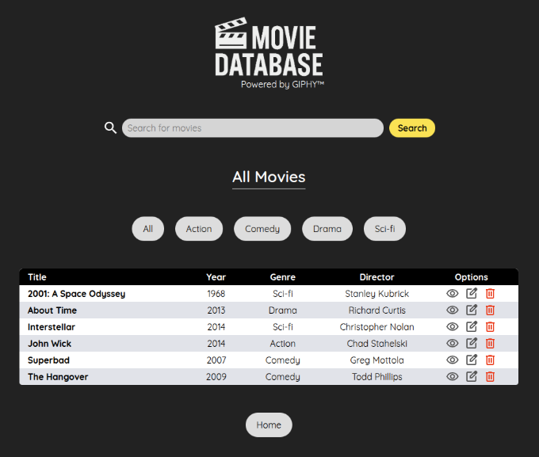
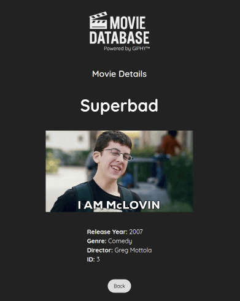

# Movie Database
A full stack inventory web application to manage and explore a collection of movies. 
Built with Node.js, Express, and PostgreSQL.

[Visit Page](https://inventory-app-production-8aa9.up.railway.app/)

## Features
- View all movies and filter by genre
- Search movies by title
- Add and delete movies
- Responsive UI with table views
- GIPHY integration for displaying movie-related GIFs

## Tech Stack
- PostgreSQL
- Express
- Node.js
- EJS/CSS

## Screenshot
### Home Page

### Movie List Page

### Details page

